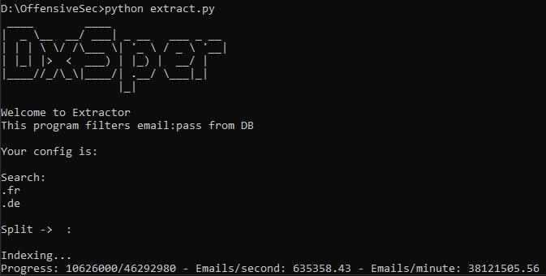

# Extractor

Welcome to Extractor! This program filters email:pass pairs from a database (DB) file based on your configuration. 

## Introduction

Extractor is a Python program designed to extract email:password pairs from a database file using user-defined configurations. It provides the ability to filter and extract specific email addresses based on domain criteria.

## Features

- Filters and extracts email:password pairs from a database file.
- Customizable configurations for filtering.
- Displays real-time progress during extraction.
- Efficient and user-friendly.

## Getting Started

1. **Requirements**: Make sure you have Python installed on your system.
   
2. **Clone Repository**: Clone this repository to your local machine.

git clone https://github.com/DxSper/Extractor.git

3. **Configuration**:
- Configure your search criteria by adding domain entries to the `search_config.txt` file, with one domain per line.
- Set the separator for email:password pairs in the `split_config.txt` file.

4. **Running the Program**:

python extractor.py

Follow the prompts and let the program filter and extract the email:password pairs.

5. **Output**:
The extracted email:password pairs will be saved in the `db_extracted.txt` file.

## Configuring Search and Split

- `search_config.txt`: Add domains to filter the email addresses. One domain per line.
- `split_config.txt`: Set the separator used in your database file to split email:password pairs.

## Example Usage

1. Add desired domain filters to `search_config.txt`:

.fr
.com
web.de

2. Set the email:password pair separator in `split_config.txt`:

:

3. Run the program and let it extract the email:password pairs based on your configuration.

## License

Disclaimer:
This program, Extractor, is designed solely for legitimate and ethical purposes such as data management and analysis. It is not intended for any malicious or harmful activities. Any misuse, unauthorized access, or inappropriate use of this program is strictly prohibited.

By using Extractor, you acknowledge that you will use it responsibly and in compliance with all applicable laws and regulations. The creator of this program assumes no responsibility for any consequences arising from the misuse of the program.

Please use Extractor only for lawful purposes and with the appropriate permissions. If you choose to use it for any other purpose, you do so at your own risk and responsibility. The creator of this program will not be held liable for any actions taken by users in violation of this disclaimer.

Use Extractor responsibly and ethically.

This project is licensed under the [MIT License](LICENSE).

## Acknowledgements

- [Python](https://www.python.org/)
